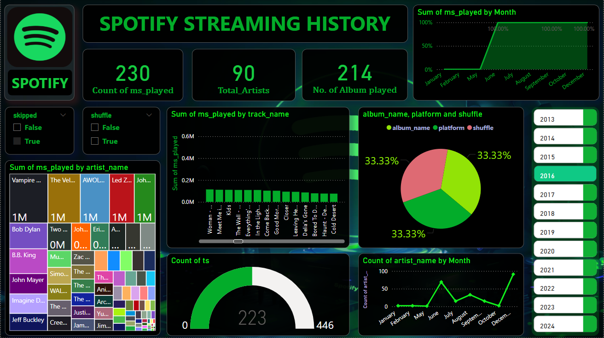

# Spotify_Streaming_History
# 🎧 Spotify Streaming Data Analysis Dashboard

This project visualizes and analyzes personal Spotify listening history using Power BI. It explores trends in music consumption, artist popularity, and playback behavior over time to generate meaningful insights from raw streaming data.

## 📌 Project Objectives

- Build an interactive dashboard to explore user streaming behavior.
- Identify top artists, tracks, and albums based on play time.
- Analyze monthly listening patterns, skipped tracks, and shuffle usage.
- Use visual storytelling to uncover user engagement trends.

## 🛠 Tools & Technologies

- **Power BI** – Dashboard creation & DAX calculations
- **Power Query** – Data cleaning and transformation
- **Spotify Data** – Exported streaming history

## 📊 Key Dashboard Features

- Total minutes streamed, number of artists and albums played
- Track-wise and artist-wise playback metrics
- Pie chart showing album, platform, and shuffle distribution
- Filters for skipped tracks, shuffle usage, and year-wise analysis

## 📷 Dashboard Preview

## 🚀 How to Use

1. Open the `Dashboard1.pbix` file in Power BI Desktop
2. Load the dataset and refresh if needed
3. Interact with filters to explore your listening patterns

## 📌 Conclusion

This dashboard offers a detailed look into personal Spotify usage—revealing music preferences, time-based habits, and engagement metrics. It demonstrates how raw user data can be transformed into valuable insights using business intelligence tools.

---

**Made with PowerBI  by Ankit Mishra**

